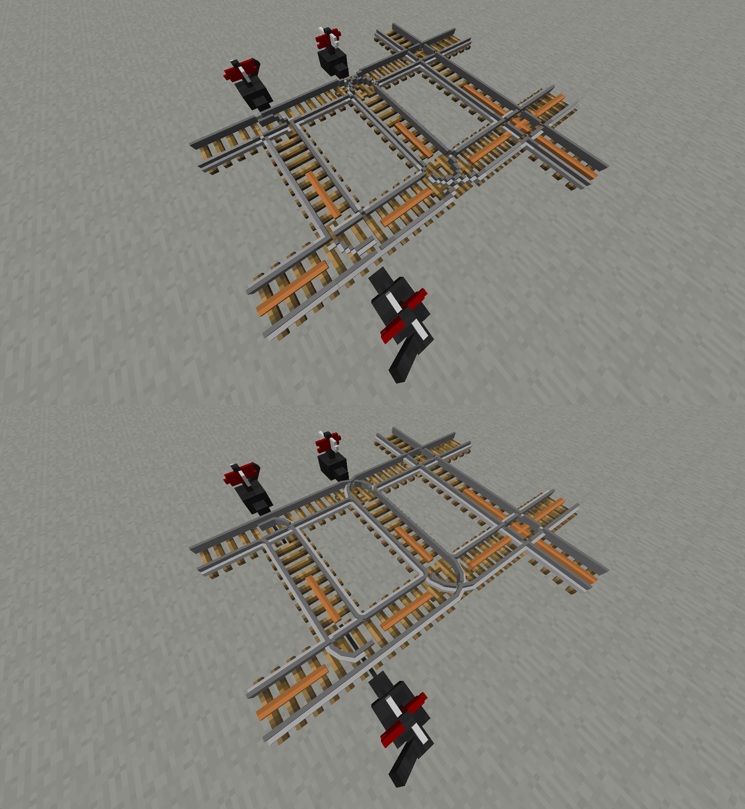

# Railcraft-3D
A Minecraft Resource Pack to enable 3D Track models for Railcraft and Vanilla Track.

Currently supported Minecraft versions:

1.10

1.12

1.16+ Vanilla only, there are many bugs with this pack in Railcraft betas for these versions

## Improvements in this fork

### Fancy turns and junctions

Turns and junctions have been rebuilt with angled pieces so they look much smoother, 
but still Minecraft enough.

### More realistic slopes with support frame

Slopes now have a support construction, so they are not levitating in the air anymore.
Both ends of the slope smoothly connect to the ongoing rail.

### 3D force track emitter tracks

Unfortunately the tracks are not transparent, because it would need to be enabled in the Railcraft code.

### Rusty abandoned tracks

Abandoned tracks got a new rusty color and their wooden ties are covered with moss.
The grass color has been fixed.

### Fixed UV map bleeding

UV bleeding was fixed by reducing UV map sizes a tiny bit.

### Turned off ambient occlusion because it is buggy

Ambient occlusion is now disabled on all track models.
It also fixes problems with Z-fighting where rail ends overlap. 

### Fixed many visual glitches

## Showcase

## How to install

Download the latest ZIP file with the resource pack in [Releases](releases)
and move it to your `.minecraft/resourcepacks` folder (see [Instructions](Instructions.txt)).

You can also clone this repository and make the archive using 
`zip railcraft-3d -r -q assets pack.mcmeta pack.png Instructions.txt` 
command.

## What is Railcraft?

Railcraft is a mod written for the hit game [Minecraft](https://minecraft.net/). It is built on top of the [Minecraft Forge](https://github.com/MinecraftForge) API.

It greatly expands and improves the Minecart system in Minecraft. Adding many new blocks, entities, and features. It has been in development since 2012 and contains over 800 class files and hundreds of thousands of lines of code.

The mod was created and is still currently maintained by the user going by the name **CovertJaguar**.

## Official Links

* The Official Railcraft Project: https://github.com/CovertJaguar/Railcraft
* The Blog, Forums, and main download page: http://www.railcraft.info
* The Wiki: http://railcraft.info/wiki
* IRC: #railcraft on Esper.net - [WebChat](http://webchat.esper.net/?nick=RailcraftGithub...&channels=railcraft&prompt=1)
* Patreon Page: http://www.patreon.com/CovertJaguar

## Contributing

The Official Railcraft 3D Project welcomes contributions from anyone, provided they have signed the Contributor Licensing Agreement (CLA) found [here](https://cla-assistant.io/CovertJaguar/Railcraft-3D).

Signing the CLA is simple, just follow the link, and hit the "I Agree" button and you are good to go.

Regarding new features/behavior changes, please submit a Suggestion Issue to the Tracker before you write a single line of code. Keeping everyone on the same page saves time and effort and reduces negative experiences all around when a change turns out to be controversial.

Also, as a bonus. If submit a Pull Request that ends up being 'merged into dev' you are eligible to receive beta access. To redeem, contact CovertJaguar on IRC.

## License

Railcraft is licensed under a custom usage license tailored specifically for the project. It can be read [here](https://github.com/CovertJaguar/Railcraft/blob/master/LICENSE.md).

 * Key things to keep in mind:
  * You may **NOT** create works using the Railcraft code (source or binary) without CovertJaguar's explicit permission except in the cases listed in this license.
  * You may **NOT** create derivative Jars from Railcraft source to distribute to other users.
  * You **MAY** use snippets of Railcraft Code posted on the Official Github in your own projects, but only if your project consists of less than 25% of Railcraft derived code. You must give credit to the Railcraft Project for the code used, including a link to the Github Project. Put this in your class file headers that contain Railcraft code, in your readme, and on the main download page.
  * You may **NOT** use Railcraft Art Assets in other projects **unless** the project is intended to operate alongside Railcraft. Examples are Addons, Resource Packs, and InterMod Integration.
  * You **MAY** fork and edit the Github Project for the purpose of contributing to the Official Railcraft Project. You may **NOT** distribute any Jar created from a fork for any reason.
  * All contributions to the Official Railcraft 3D Project must be covered by a Contributor Licensing Agreement signed by the contributor.
